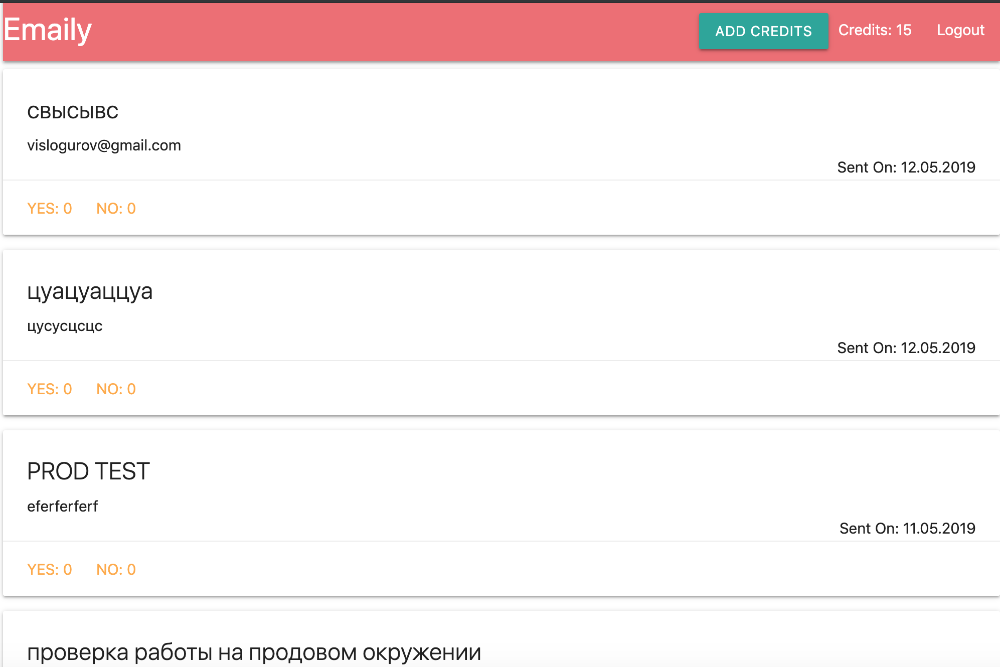

# Почтольер ака Emailer


Почтольер – это сервис для создания рассылки писем.

Под капотом:
* Фронтенд на [CRA](https://github.com/facebook/create-react-app) + [Redux](https://redux.js.org/) + [ReduxForm](https://redux-form.com/). В качестве средства стилизации использован [materializecss](https://materializecss.com/)
* Бэкенд на Node + [mongoose](https://mongoosejs.com/) + [MongoDB](https://www.mongodb.com/)
* Авторизация через  Google Account с использованием [PassportJS](http://www.passportjs.org/packages/passport-google-oauth20/)
* [Stripe](https://stripe.com/) – для эмуляции работы платёжных систем
* [Sendgrid](https://sendgrid.com/) – сервис для сбора аналитики почтовых рассылок

## Пролог

Приложение может работать, как в продовом, так и в локальных окружениях. По этой причине и из соображений безопасности (чтобы в репозиторий не попали персональные данные в т.ч пароли от БД), созданы определённые требования к стуктуре приложения:
- в `/config` нужно создать файл `key.js`  со следующими ключами:

| Ключ                 | Значение ключа                                                                                               |
|----------------------|--------------------------------------------------------------------------------------------------------------|
| googleClientID       | Учётные данные для использования Google API. Создаются [тут](https://console.developers.google.com/)         |
| googleClientSecret   | Учётные данные для использования Google API. Создаются [тут](https://console.developers.google.com/)         |
| mongoURI             | Путь к базе данных, типа `mongodb+srv://<userName>:<password>@emailer-u24fp.mongodb.net/test?retryWrites=true` |
| cookieKey            | Уникальный набор символов для создания куки в [cookie-session](https://github.com/expressjs/cookie-session#keys)              |
| stripePublishableKey | [Учётные данные](https://stripe.com/docs/keys) для использования Stripe                                         |
| stripeSecretKey      | [Учётные данные](https://stripe.com/docs/keys) для использования Stripe                                         |
| sendGridKey          | [Учётные данные](https://app.sendgrid.com/settings/api_keys) для испльзования SendGrid                           |
| redirectDomain       | Адрес страницы, на которую редиректит пользователя, кликнувшего по ссылке в письме http://localhost:3000 или адрес продового сервака, например на Heroku                         |

Для работы в продовом окружении таким же образом, но через *__переменные окружения__*, добавляются ключи в `/config/prod.js`, например :

| Ключ                 | Значение ключа                                                                                               |
|----------------------|--------------------------------------------------------------------------------------------------------------|
| googleClientID       | process.env.GOOGLE_CLIENT_ID         |

__ВАЖНО__: `key.js` не коммитить! Он нужен только для локальной разработки и будет содержать ваши персональные данные.

## Основная часть

Для проверки работы на проде приложение развёрнуто на [Heroku](https://sleepy-fjord-55767.herokuapp.com)

### Стартовый экран – логинимся


### Пополняем баланс

Одна рассылка – один доллар. Система не даст создать рассылку при нулевом балансе. Нужно пополнить счёт:


### Создаём рассылку

Суть рассылки в сборе фидбека (о чём угодно), пользователь может кликнуть `yes` или `no`. В зависимости от этого ответа вносим изменения в БД.

Сам текст рассылки лежит в `/services/emailTemplates/surveyTemplate.js`

Если пользователь новый, то будет список рассылок будет пустой.

Для создания новой рассылки кликаем на красную кнопку, заполняем поля:


Действия по кнопкам:

-  – возвращаемся к списку рассылок

-  – смотрим на превью рассылки

-  – возвращаемся к заполнению формы, если нужно что-доработать (данные сохранаются при `unmount`'е)

-  – если всё ок, то отправляем рассылку.

Пользователя возвращает к списку рассылок. Список рассылок пополняется вновь созданной рассылкой:



## Модели

Работа с БД представлена тремя моделями:

### User

| Поле     | Тип поля                     |
|----------|------------------------------|
| googleId | String                       |
| credits  | { type: Number, default: 0 } |

### Recipient

| Поле      | Тип поля                          |
|-----------|-----------------------------------|
| email     | String                            |
| responded | { type: Boolean, default: false } |

### Survey

| Поле          | Тип поля                                     |
|---------------|----------------------------------------------|
| title         | String                                       |
| body          | String                                       |
| subject       | String                                       |
| recipients    | [RecipientSchema] // список адресатов        |
| yes           | { type: Number, default: 0 }                 |
| no            | { type: Number, default: 0 }                 |
| _user         | { type: Schema.Types.ObjectId, ref: 'User' } |
| dateSent      | Date // дата отправки письма                 |
| lastResponded | Date // уведомление о получении фидбэка      |


## API

| URL            | Method | Request | Response    |
|----------------|--------|---------|-------------|
| `/api/surveys` | GET    |         | [...SURVEY] |
|                |        |         |             |
|                |        |         |             |
|                |        |         |             |
|                |        |         |             |
|                |        |         |             |
|                |        |         |             |
|                |        |         |             |
|                |        |         |             |

SURVEY
```
{
  "yes":0,
  "no":0,
  "_id":"5ccd5c20bd5c260a6c27c062",
  "title":"sdcdssc",
  "subject":"dcd44",
  "body":"dssdscs",
  "_user":"5cc45feceb67ba1a34c41137",
  "dateSent":"2019-05-04T09:32:16.571Z",
  "__v":0
}
```
